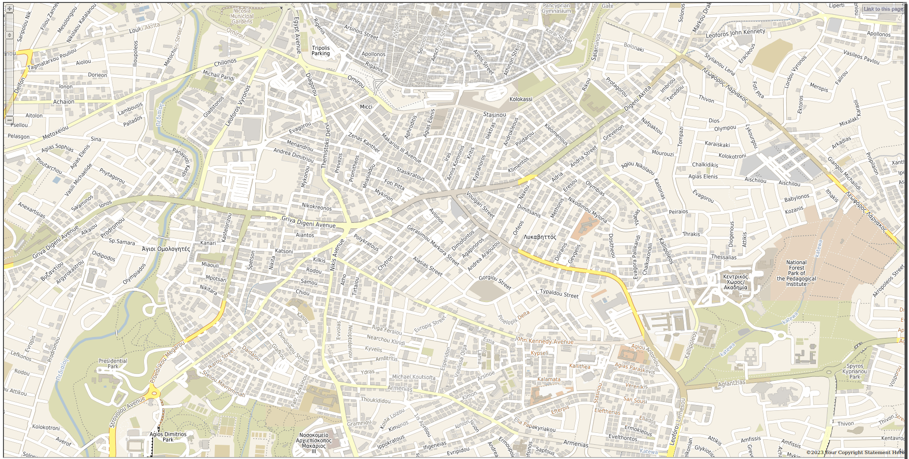

# maps



")


```
apt install -y pkg-config \
    libgd-dev \
    autoconf \
    libpng-dev \
    libjpeg-dev \
    libproj-dev \
    libgdal-dev \
    libcairo-dev \
    libgeos-dev \
    libgif-dev \
    libfreetype-dev \
    cmake \
    swig
```

Install tcl.gd for NaviServer:
```
git clone https://github.com/flightaware/tcl.gd.git
cd tcl.gd
autoreconf
./configure --with-tcl=/usr/local/ns/lib/
make
make install
```

Install MapServer for NaviServer:
```
git clone https://github.com/jerily/openacs-packages.git
wget https://download.osgeo.org/mapserver/mapserver-8.0.1.tar.gz
tar -xzvf mapserver-8.0.1.tar.gz
cd mapserver-8.0.1
mkdir build
cd build
cmake .. -DWITH_FCGI=0 -DWITH_HARFBUZZ=0 -DWITH_FRIBIDI=0 -DWITH_PROTOBUFC=0 -DWITH_THREAD_SAFETY=1 -DCMAKE_BUILD_TYPE=Debug -DCMAKE_INSTALL_PREFIX=/usr/local/ns
make
make install
cd ../mapscript/tcl
cp ../../../openacs-packages/maps/files/* .
mv mapscript.i ..
swig -tcl8 -I/usr/local/ns/include/mapserver/ -outcurrentdir -namespace -DUSE_NAVISERVER ../mapscript.i
make
make install
```
