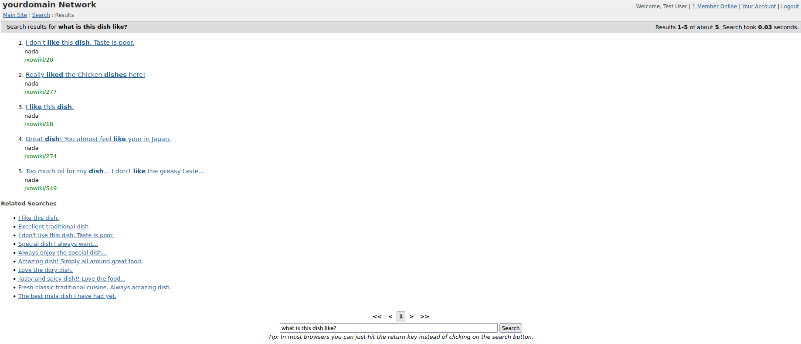
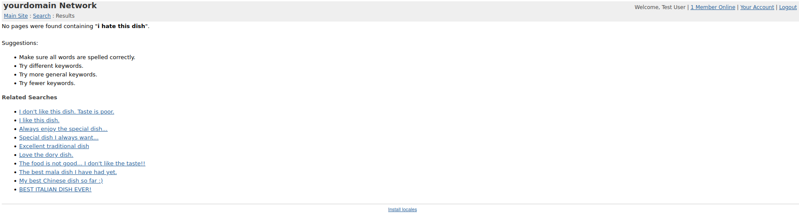

# pgvector-driver




## Install pgvector
```
git clone --branch v0.4.4 https://github.com/pgvector/pgvector.git
cd pgvector
make
make install
```

## Try it out using docker
```
docker build . -t pgvector-driver:latest
docker run --network host pgvector-driver:latest
```

## Use with naviserver
```
git clone --recurse-submodules git@github.com:jerily/tbert.git
cd tbert
mkdir build
cd build
cmake .. -DBUILD_SHARED_LIBS=ON -DCMAKE_BUILD_TYPE=Release -DNAVISERVER=/usr/local/ns
make
make install
```
Add the following to your OpenACS/NaviServer config under the modules section i.e. ns_section ns/server/$server/modules:
```
set libtbert [lindex [lsort [glob -nocomplain $homedir/lib/libtbert*[info sharedlibextension]]] end]
ns_param libtbert $libtbert
```

