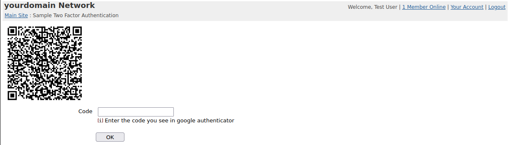

# sample-2fa



Add the following to your OpenACS/NaviServer config under the modules section i.e. ns_section ns/server/$server/modules:
```
set libtmfa [lindex [lsort [glob -nocomplain $homedir/bin/libtmfa*[info sharedlibextension]]] end]
ns_param libtmfa $libtmfa

set libtqrcodegen [lindex [lsort [glob -nocomplain $homedir/bin/libtqrcodegen*[info sharedlibextension]]] end]
ns_param libtqrcodegen $libtqrcodegen
```

